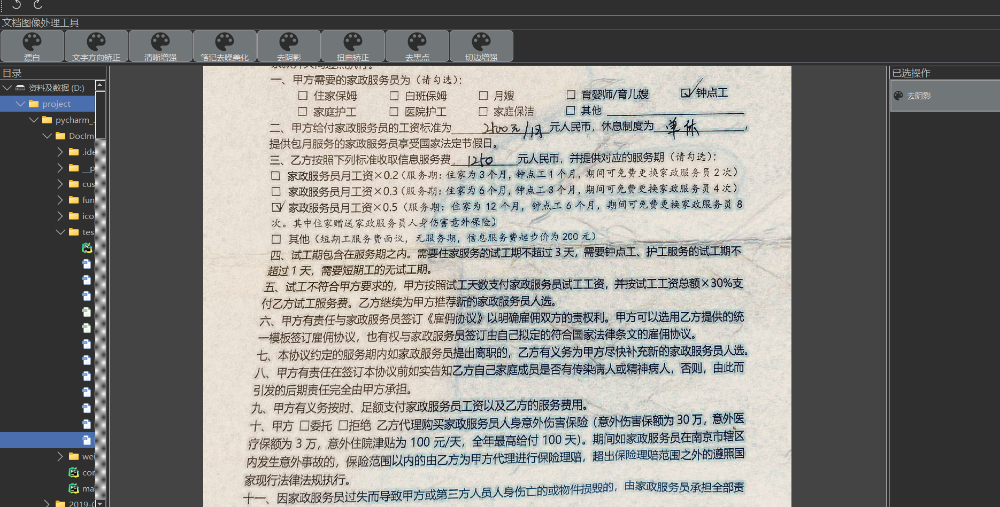

# docimg_tool(document image processing tool)

文档图像处理工具.

实现一个简单的文档图像处理工具，主要功能包括复杂背景图像漂白，文字方向矫正，清晰增强，笔记去躁美化，去阴影，扭曲矫正，去黑点以及切边增强，后面会持续增加关于AI在文档图像上的应用功能。

To achieve a simple document image processing tool, the main functions include complex background image bleaching, text direction correction, clarity enhancement, note to blur beautification, shadow removal, distortion correction, black spots removal and cutting edge enhancement, and will continue to increase the application functions of AI on document images.

## display
 

 

 

 

 

 

 

 

 

 

 

 

## contact me
- github：https://github.com/jiangnanboy
- blog：https://www.cnblogs.com/little-horse/
- email:2229029156@qq.com
